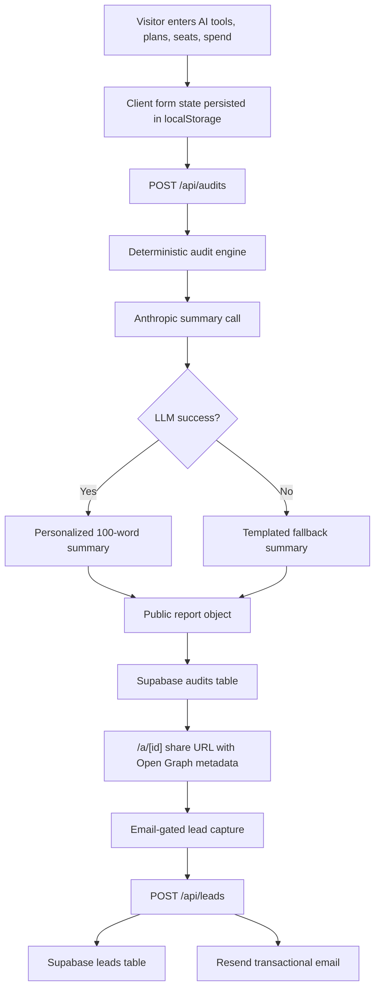

# Architecture



## Data Flow

The user enters team size, primary use case, and one row per paid AI tool. Client state persists in `localStorage`, so a reload does not erase the form. When the user runs the audit, `/api/audits` sanitizes input, runs `src/lib/audit.ts`, generates a summary through Anthropic or a fallback template, strips private lead fields, saves the public report, and returns a unique URL.

Lead capture happens after value is shown. `/api/leads` validates email, checks a honeypot field and IP rate limit, stores the lead, and sends the confirmation email through Resend when configured.

## Stack Choice

I chose Next.js with TypeScript because the product needs a fast React UI, public report pages with metadata, and server-side API routes. TypeScript keeps the audit engine, pricing catalog, and report schema explicit. The app uses plain CSS to keep Lighthouse and deploy complexity under control.

## Production Storage Schema

```sql
create table audits (
  id bigint generated by default as identity primary key,
  public_id text unique not null,
  input jsonb not null,
  result jsonb not null,
  public_report jsonb not null,
  summary text not null,
  created_at timestamptz not null default now()
);

create table leads (
  id bigint generated by default as identity primary key,
  public_id text references audits(public_id),
  email text not null,
  company_name text,
  role text,
  team_size integer,
  savings_monthly numeric,
  high_savings boolean not null default false,
  created_at timestamptz not null default now()
);
```

## 10k Audits Per Day

At 10k audits/day, I would move rate limits from memory to Upstash Redis or Supabase Edge Functions, queue email sending, add a pricing-data refresh job, and separate audit writes from lead writes for clearer analytics. I would also add event instrumentation for each funnel step and cache public reports at the edge.
