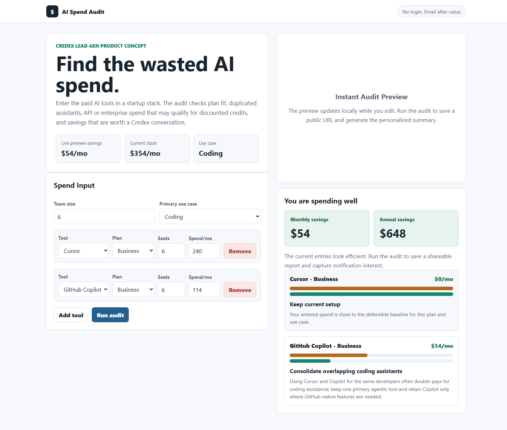
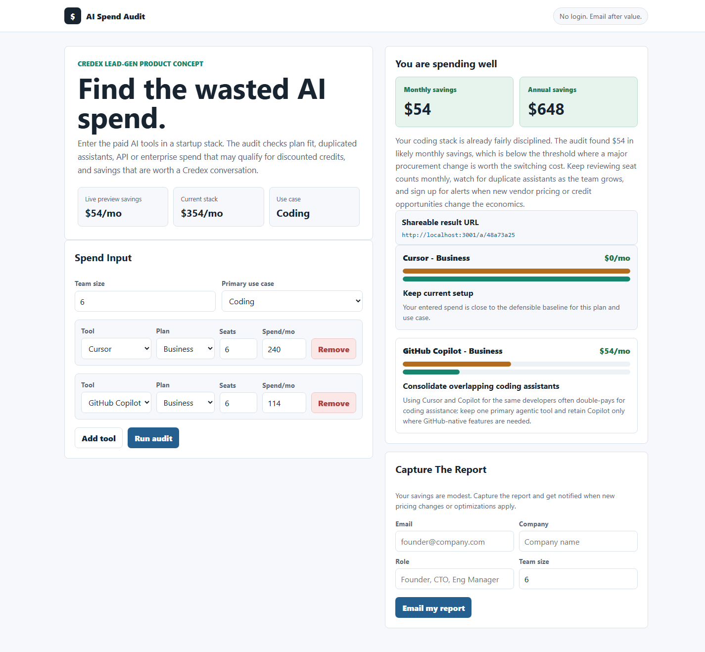
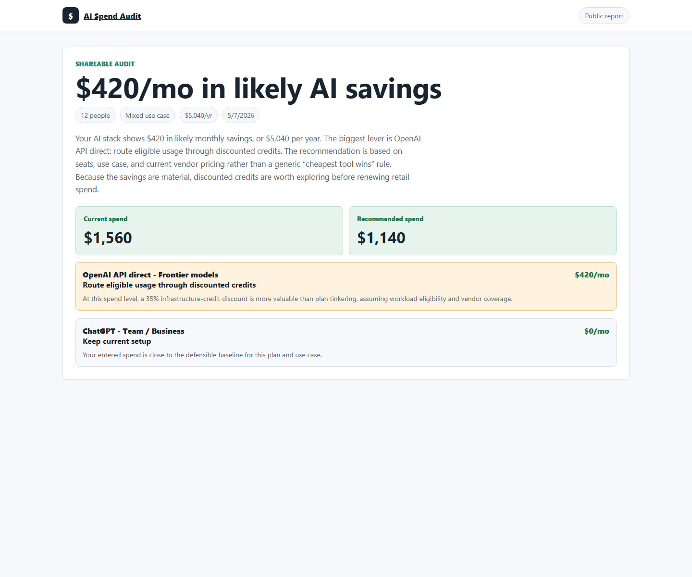

# AI Spend Audit

AI Spend Audit is a free web app for startup founders and engineering managers who want a second opinion on AI tool spend before renewing another month of retail pricing. Users enter their paid AI stack, see instant plan-fit and discounted-credit savings, then can save a public report URL and capture the report by email.

Live deployed URL: **add after deployment**

## Screenshots







## Quick Start

```bash
npm install
npm run dev
```

Open `http://localhost:3000`.

For production, create Supabase tables using the schema in `ARCHITECTURE.md`, configure `.env` from `.env.example`, then deploy to Vercel or another Next.js host.

## Required Environment

- `SUPABASE_URL` and `SUPABASE_SERVICE_ROLE_KEY` store audits and leads in a real backend.
- `RESEND_API_KEY` sends the transactional audit email.
- `ANTHROPIC_API_KEY` generates the personalized summary; the app falls back to a deterministic summary if the API fails.
- `NEXT_PUBLIC_SITE_URL` is used for share URLs and Open Graph metadata.

## Decisions

1. **Next.js + TypeScript:** chosen because the assignment needs a polished app plus server routes for storage, email, LLM calls, and share pages without a separate backend service.
2. **Hardcoded audit engine:** pricing and plan-fit logic is deterministic and testable; AI is only used for the summary because math should be inspectable.
3. **Supabase through REST:** avoids a client SDK dependency and keeps the backend real for deployment while allowing local JSON storage for dev.
4. **Email after value:** the form never asks for email until after the user sees savings, matching the assignment’s lead-capture constraint.
5. **Honeypot + rate limit:** lightweight abuse protection fits a free tool at this stage without adding captcha friction to a founder workflow.

## Scripts

```bash
npm run lint
npm test
npm run build
```
